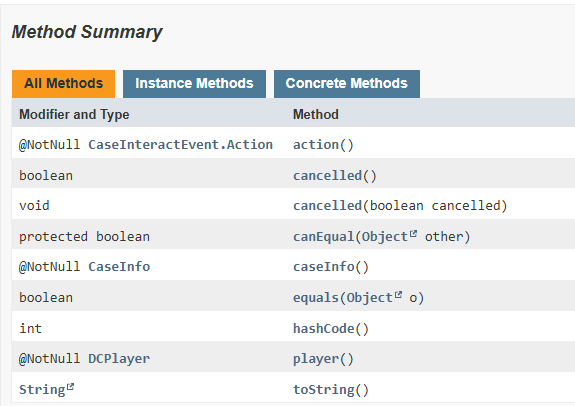

# DCEventManager Wiki
Цей аддон дозволяє вам керувати івентами DonateCase<br></br>
З його допомогою ви можете виконувати певні дії, такі як надсилання повідомлень і виконання команд від імені консолі. <br></br>
**Як це працює?**<br></br>
Аддон прослуховує всі події, зареєстровані в DonateCase.
Отримання подій відбувається за допомогою рефлексії, а це означає, що при оновленні DonateCase нові події будуть автоматично завантажуватися в DCEventManager без необхідності оновлювати аддон! <br></br>

## Приклад config.yml
```yml
Debug: false
Package: "com.jodexindustries.donatecase.api.events" # не змінюйте це

Events:
  MyEvent:
    Event: AnimationStartEvent
    Actions:
      - "[command] say Анімація почалась!"

  MyAnotherEvent:
    Event: AnimationEndEvent
    Actions:
      - "[broadcast] &dАнімація завершена!"
```

## Івенти
> **Список всіх доступних подій [тут](https://repo.jodexindustries.xyz/javadoc/releases/com/jodexindustries/donatecase/spigot-api/2.0.1/raw/com/jodexindustries/donatecase/api/events/package-summary.html)**

## Дії
### [Усі дії DonateCase](../items-settings#дії)
### Дії DCEventManager
#### Виклик методу
Приклад
`- [invoke] setCancelled(true)`

## Підтримка конкретного кейсу
Працює, лише якщо у події є методи `getCaseType` або `getCaseData`
```yaml
Events:
  MyEvent:
    Event: AnimationStartEvent # ваш івент
    Case: case # тут конкретний кейс
    Actions:
      - "[command] say Case opened!"
```

## Підтримка конкретного слота кейсу
Працює лише у випадку, якщо у події є метод `getSlot`
```yaml
Events:
  MyEvent:
    Event: CaseGuiClickEvent # ваш івент
    Case: case # тут конкретний кейс
    Slot: 1 # тут конкретний слот
    Actions:
      - "[command] say Gui clicked!"
```

## Заповнювачі
У DCEventManager є своя власна система заповнювачів, яка дозволяє вам використовувати **ВСІ** методи, що надаються подіями.<br></br>
**Ця система працює за допомогою Рефлексії!**<br></br>

Приклад заповнювачів:
```yaml
Events:
  AddonDisableEvent: # назва класу івенту
    addon: # айді заповнювача
      placeholder: "%addon%" # замінений плейсхолдер
      method: "getAddon#getName" # метод класу
    reason: # айді заповнювача
      placeholder: "%reason%" # замінений плейсхолдер
      method: "getReason" # метод класу
    caused: # айді заповнювача
      placeholder: "%caused%" # замінений плейсхолдер
      method: "getCaused#getName" # метод класу
```

Якщо ви не розбираєтесь у програмуванні, це може виглядати трохи заплутано через параметр `method`.
Але не засмучуйтесь, це просто! <br></br>
Цей параметр використовується для визначення місця, звідки буде взято значення placeholder. <br></br>

Давайте подивимось на JavaDocs [AddonDisableEvent](https://repo.jodexindustries.xyz/javadoc/releases/com/jodexindustries/donatecase/spigot-api/2.0.1/raw/com/jodexindustries/donatecase/api/events/AddonDisableEvent.html#method-summary) класу<br></br>


Тут ми бачимо, що клас [AddonDisableEvent](https://repo.jodexindustries.xyz/javadoc/releases/com/jodexindustries/donatecase/spigot-api/2.0.1/raw/com/jodexindustries/donatecase/api/addon/internal/InternalAddon.html#method-summary) має кілька цікавих методів, таких як: `getAddon`, `getCaused` та `getReason`. <br></br>
Думаю, ви вже здогадались, що ці методи використовуються для отримання значень placeholder, але що таке `#`? <br></br>
Це символ для розділення методів. Наприклад, ми викликаємо метод getAddon, який є об’єктом [InternalAddon](https://repo.jodexindustries.xyz/javadoc/releases/com/jodexindustries/donatecase/api/2.0.1/raw/com/jodexindustries/donatecase/api/addon/internal/InternalAddon.html), що має такі методи:

Звичайно, буде трохи дивно просто відображати інформацію про деякі [InternalAddon](https://repo.jodexindustries.xyz/javadoc/releases/com/jodexindustries/donatecase/api/2.0.1/raw/com/jodexindustries/donatecase/api/addon/internal/InternalAddon.html) без додаткових інструкцій, але варто подивитись, що це за клас. Схоже, він представляє інтерфейс внутрішнього аддона, і ми можемо витягти з нього корисну інформацію! Давайте дізнаємось ім'я цього аддона, схоже, що метод [getName](https://repo.jodexindustries.xyz/javadoc/releases/com/jodexindustries/donatecase/api/2.0.1/raw/com/jodexindustries/donatecase/api/addon/Addon.html#getName()) якраз нам підходить! <br></br>
Тепер наш метод виглядає так: `getAddon#getName`<br></br>

Якщо у вас є додаткові питання, будь ласка, зв'яжіться з нами у [Discord сервері](https://discord.gg/2syNtcKcgR)!
